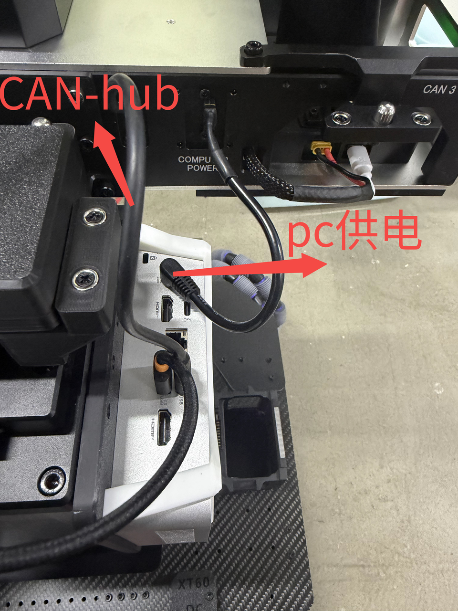
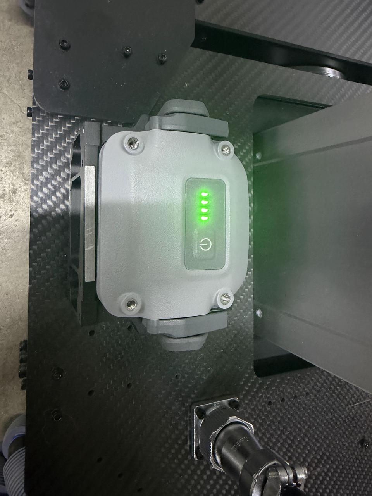
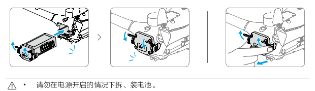
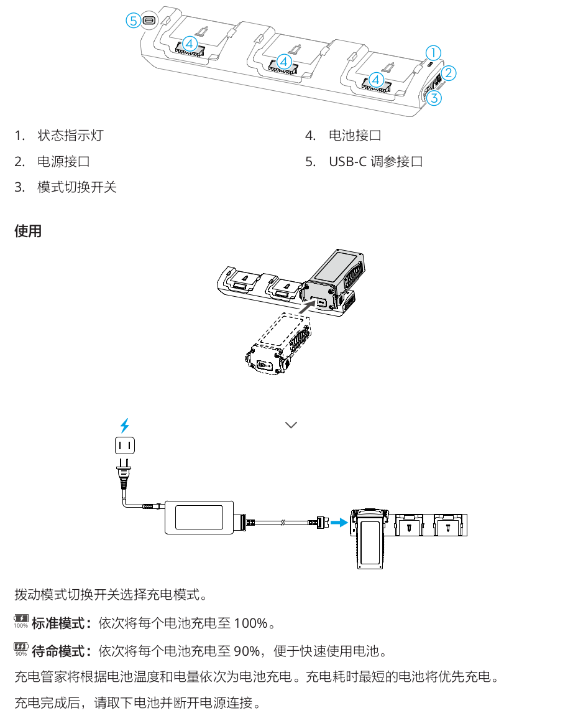
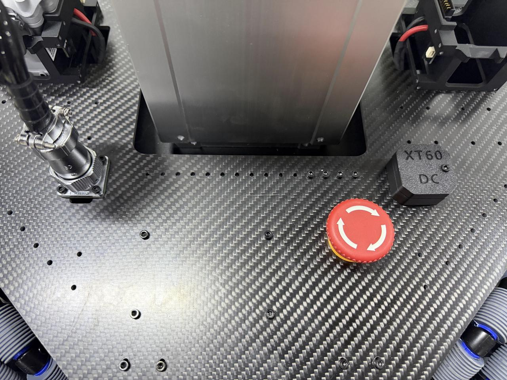
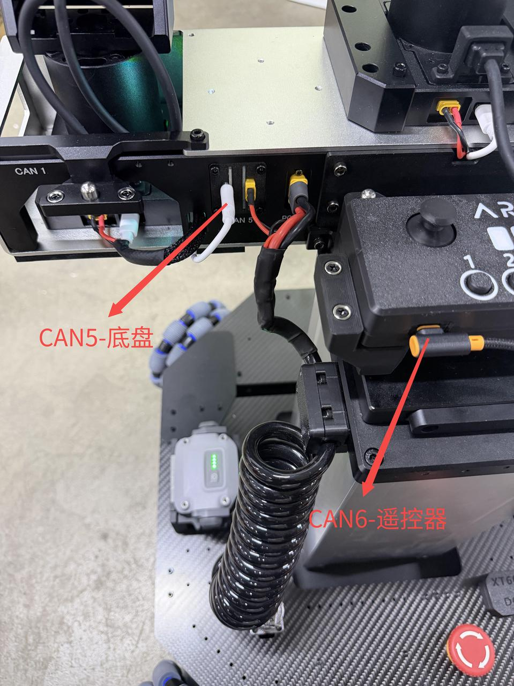
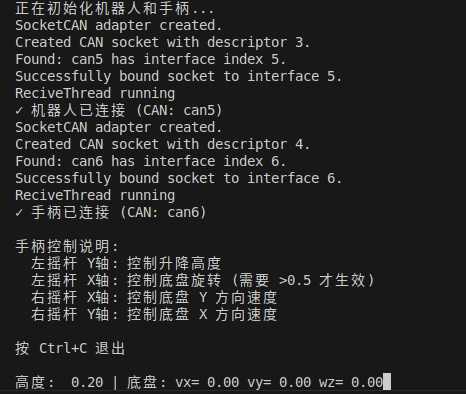
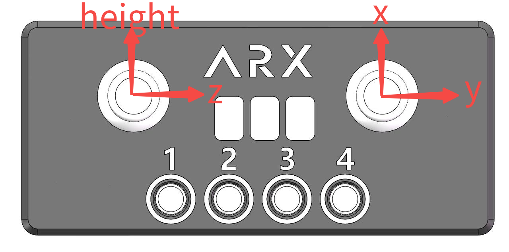
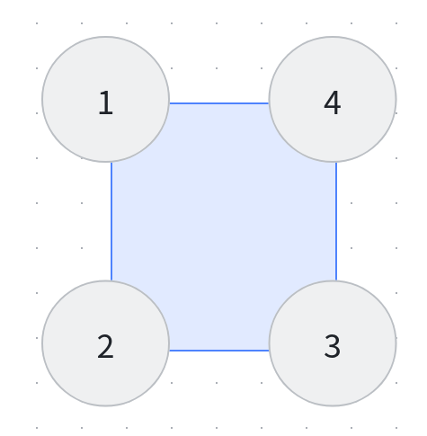

# LIFT\-mini\-SDK

# 环境配置

与单臂环境配置一致
参考[A5 python SDK\.md](https://github.com/ARXroboticsX/A5)

# 硬件连接



## 电池安装与充电

本设备采用双电池组，支持热拔插进行快速替换。







注意启动时将即停开关提前旋开

出现紧急情况用脚或工具将即停开关按下，注意断电时升降设备坠落



# CAN配置

同单臂设置，设置时目标设备单独连接

底盘CAN5

遥控器CAN6


| 左臂   | CAN1 |
| ------ | ---- |
| 头部   | CAN0 |
| 右臂   | CAN3 |
| 底盘   | CAN5 |
| 遥控器 | CAN6 |



# Demo

## 遥控器控制

启动CAN设备。A5/ARX\_CAN/目录下。

```Plain
./arx_can5
./arx_can6
```

LIFT\-mini/目录下

```Plain
./build.sh

source setup.sh
python3 joystick_control.py 
```





# SDK

## 高度值获取

```Plain
robot.get_height()
```

## 高度设定

范围0\-0\.38 单位m

```Plain
robot.set_height(set_lift_height)
```

## 整体速度控制

单位m/s

```Plain
# 设置底盘速度 x y z mode =1 为整体速度控制  单位m/s
robot.set_chassis_cmd(0,0,0,1)
```

## 轮组速度控制及反馈

单位rad/s



```Plain
# 轮速控制，设置模式为3
robot.set_chassis_cmd(0,0,0,3)
robot.set_wheel_vel(1,0,0,0)

get_wheel_vel=robot.get_wheel_vel()
```
